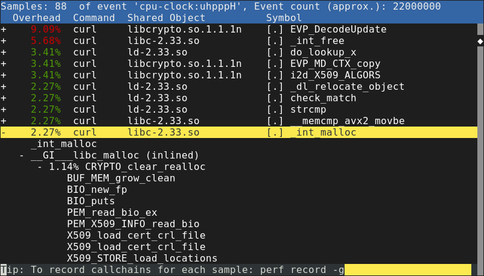
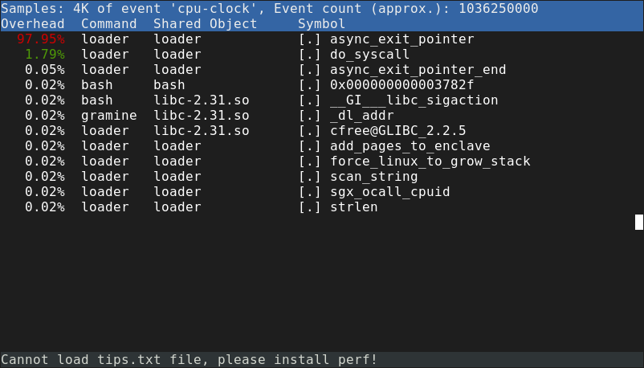
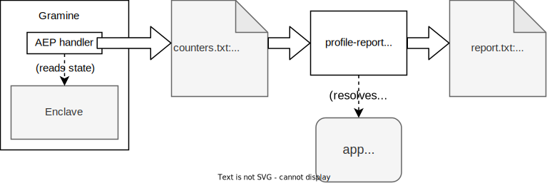
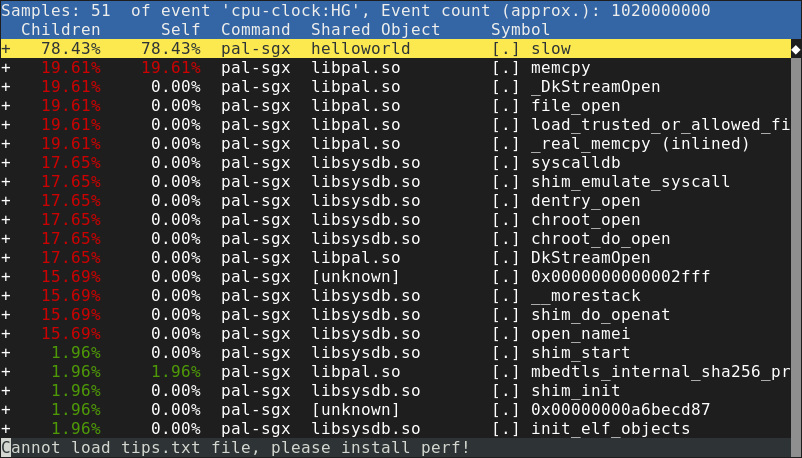

*This blog post describes how I developed the SGX profiling mode for Gramine.
Thanks to Dmitrii Kuvaiskii and Michał Kowalczyk for reviewing.*

[Gramine](https://gramineproject.io) is a framework for running Linux applications under non-standard
environments, currently with [Intel SGX](https://en.wikipedia.org/wiki/Software_Guard_Extensions) enclaves as the main use case. In the
[previous article](/blog/gdb-support-in-gramine/), I described adding GDB support for Gramine. Today,
I'll describe adding support for profiling.

[Profilers](https://en.wikipedia.org/wiki/Profiling_(computer_programming)) allow analyzing program behavior, for instance by presenting
statistics of time spent in a given function. In the context of Gramine, a
profiler is a pretty useful tool: it's quite possible that using Gramine for an
application will add some overhead, and using a profiler, we can find out its
source.

(There might be different reasons for such overhead. For instance, Gramine might
implement a feature in an inefficient way, or not provide a feature at all,
causing the application to fall back to suboptimal behavior. The inefficiency
might also be due to the constraints of specific Gramine environment: for
instance, the `fork` operation under SGX is pretty much guaranteed be slower
than in native Linux. A profiler helps with understanding where exactly the
execution time is being spent.)

Unfortunately, similar to what we've seen with GDB, Gramine's SGX mode does not
support profiling tools out of the box: by default, the code executing inside an
SGX enclave is opaque to external tools.

When searching for a solution, I tried to adapt a standard tool (`perf`), and,
when that failed, to write my own profiler. In the end, I arrived at a hybrid
solution: Gramine gathers its own data about SGX enclave execution, but uses
`perf` for processing data and displaying statistics.

## Using `perf`

[perf](https://perf.wiki.kernel.org/index.php/Main_Page) is usually a pretty good choice for Linux profiling. It's a tool that is
partially built into the Linux kernel. By running `perf record`, we can ask
Linux to record a trace of program execution. Then, `perf report` will interpret
that data and show time spent in each function. Here is an example of a report
from `perf`:

The architecture of `perf` is interesting. In order to monitor a running
process, `perf record` asks the Linux kernel to collect events from it (using
the [perf_event_open](https://man7.org/linux/man-pages/man2/perf_event_open.2.html) system call). The Linux kernel records *samples*, which
typically contain some execution state (instruction pointer, stack pointer,
etc.). Linux also records information about executable files (main binary and
shared libraries) mapped by the application.

This information is then forwarded to `perf record`, which saves it to a file
(usually called `perf.data`). Afterwards, that file can be opened by `perf
report`. While the samples contain only raw memory addresses, `perf report` is
able to convert them to function names by using the recorded information about
mapped executables. First, it converts the memory address to offset in the
executable file, then it analyzes the executable file to find out which function
the offset corresponds to (similar to how [addr2line](https://linux.die.net/man/1/addr2line) does it).

`perf` is a very powerful tool. Apart from the basic statistics shown above,
it's possible to gather information about kernel execution, detailed processor
performance (e.g. cache misses), system calls, and much more. (See [Brendan
Gregg's `perf` page](https://www.brendangregg.com/perf.html) for various examples.)

In fact, when I ran Gramine in the direct (non-SGX) mode, `perf` already worked
out of the box! This might be surprising given the fact that Gramine loads
various binaries on its own: GDB needed some extra help figuring out where the
files are mapped, even in the direct mode. `perf`, however, figures that out by
recording `mmap` syscalls made by Gramine.

In SGX mode, however, things were not looking as good. It turns out that `perf`
will assign all time spent inside an SGX enclave to a function called
`async_exit_pointer`:

_Note that in the screenshot, `loader` is the name of the main Gramine binary._

As explained in the [previous article about GDB](/blog/gdb-support-in-gramine/), Async Exit Pointer (AEP)
is where the process ends up when enclave execution is interrupted. It turns out
that the same limitation applies to `perf`. In order for Linux to record a
sample, the process must be temporarily stopped first (usually, by a timer
interrupt).

This sounds pretty difficult to work around, since the samples are being
recorded by the Linux kernel, not by the user-space `perf record` tool. Unlike a
debugger, `perf record` does not stop the process, it just keeps receiving a
stream of events about it from the Linux kernel.

I decided to move away from `perf` for the time being, and look for other ways
to profile Gramine.

## Poor man's profiler

A very simple method of profiling (if it can even be called that) is to use GDB:
run the program, hit Ctrl-C a few times and display the backtrace. This is known
as [poor man's profiler](https://readwrite.com/using-gdb-as-a-poor-mans-profi/). If there is an obvious performance issue,
repeating that a few times should be enough to notice it. Given how Gramine
already had good GDB support, I thought it was worth trying out.

However, it turns out that this method is useless for any kind of qualitative
results: we will not notice whether some function takes 1%, 5% or 15% of the
execution time. There have been attempts to [turn "poor man's profiler" into a
script](https://poormansprofiler.org/) that repeatedly asks GDB to stop the process and display
backtrace, but such a script still has massive overhead. With Gramine running in
SGX mode, it's difficult to take more than a few samples per second.

## Writing my own profiler

Still, trying out the "poor man's profiler" gave me a better idea: why couldn't
Gramine take the samples by itself? We already have the code running at the
Async Exit Pointer (AEP) handler, and we know this handler executes at least
once every 4 milliseconds (default Linux scheduler interval). What's more,
thanks to the GDB integration, I already knew how to extract the instruction
pointer value from the SGX enclave.

That was the first version of the SGX profiler: in the AEP handler, Gramine
[retrieved the instruction pointer value and recorded it in a hash
map](https://github.com/pwmarcz/graphene/blob/423b837358f6224c480e51b240437adc2798c668/Pal/src/host/Linux-SGX/sgx_profile.c#L205). Then, on process exit, it dumped the hash map of executed
code addresses.

The addresses alone might not tell us much, but we actually know which code they
correspond to. Thanks to the GDB integration, we maintain a list of loaded
binaries, which we also can dump to a file. Then, determining the function name
is a matter of using a right tool. I wrote a [helper Python script](https://github.com/pwmarcz/graphene/blob/423b837358f6224c480e51b240437adc2798c668/Pal/src/host/Linux-SGX/tools/profile-report/profile-report) that
performed this conversion using [pyelftools](https://github.com/eliben/pyelftools) and displayed a report.

## What about the stack trace?

One major limitation was that I had only information about the *current*
function, and not the function one level higher (not to mention the whole
stack). As a result, I could learn that a generic function like `memset` or
`memcpy` took most of the time, but not where it was called from.

Finding out the stack trace, or even reaching one level higher, is not trivial.
When the code is compiled in debug mode, it might be as easy as [reading the RBP
value (frame pointer)](https://eli.thegreenplace.net/2011/09/06/stack-frame-layout-on-x86-64) to find the current stack frame. The stack
frame should contain the return address as well as the *next* frame pointer,
which we can follow further.

However, as the linked article mentions, stack frames on x86-64 Linux (AMD64
ABI) are actually optional. GCC [omits them whenever optimizations are
enabled](https://gcc.gnu.org/onlinedocs/gcc/Optimize-Options.html). We might also be running some functions written in
assembly that do not use a frame pointer. As a result, the RBP register, and
values saved on stack, cannot always be trusted.

To salvage the situation, I experimented with some heuristics (e.g. is the next
frame pointer properly aligned, and lower than the current frame, but not too
low?) and stopping the stack trace whenever we suspect the value to be garbage.
It still did not work very well.

The *proper* way of recovering the stack trace is recovering the DWARF ([CFI](https://www.imperialviolet.org/2017/01/18/cfi.html))
information from a binary, and interpreting the stack based on this information.
This can be done using a library like [libdwfl](https://sourceware.org/elfutils/) or [libunwind](https://www.nongnu.org/libunwind/), either from
another process (e.g. a debugger), or from the process that wishes to examine
itself, for example, to display a stack trace on crash.

My idea was to invoke one of these libraries inside the AEP handler, find out
the whole stack trace, and write it to a file. I got as far as adapting
`libdwfl` to compile with Gramine, but the code occasionally crashed in a way I
could not debug. I decided that this approach was another dead end: I was
running a lot of complicated code, coming from external library, in what should
be a simple event handler, and in an environment where we avoid using even
`glibc`.

## How does `perf` do it?

At this point, I became curious: how does `perf` retrieve stack traces? The data
gathered by `perf` actually comes from the Linux kernel. Does that mean the
kernel parses all the binaries, and runs `libdwfl` or equivalent in order to
record the full stack trace? That sounds unlikely.

It turns out that `perf record` supports several modes for recording stack traces:

* `--call-graph=fp`, FP (frame pointer mode): in this mode, the Linux kernel
  tries to follow the frame pointer (on x86-64, the RBP register), and record
  the frames. Unfortunately, as explained above, this works only if the compiled
  code uses frame pointers, which is not guaranteed.

* `--call-graph=lbr`: this uses Intel's [Last Branch Records](https://lwn.net/Articles/680985/) feature which
  stores a short stack trace in processor's registers. I haven't really tried
  out this mode.

* `--call-graph=dwarf`: this indeed uses the DWARF information, but not from
  kernel. In this mode, the kernel *takes a snapshot of all registers, and the
  stack* (8 KB of memory above the current stack pointer) and inserts that in
  the sample. Then, the user-space tool (`perf report`) uses a DWARF library
  such as `libdwfl` in order to parse this information. Instead of digging
  through a live program's memory, we process snapshots of it, possibly long
  after the program exited.

The `call-graph=dwarf` mode looked like a promising approach. I could easily
record the same information: dump all registers, and 8 KB of stack memory,
inside the AEP handler. The hard part would be parsing all these snapshots using
DWARF information. Even with the right library, I was really not looking forward
to that.

But what if I could actually use the existing `perf report` tool?

## Feeding data to `perf report`

Up until that time, I did not seriously consider using `perf report` instead of
my Python reporting script. I did briefly think about using a viewer such as
[kcachegrind](https://kcachegrind.github.io/html/Home.html) or even [Google Chrome](https://aras-p.info/blog/2017/01/23/Chrome-Tracing-as-Profiler-Frontend/), but these tools expect
samples with already-parsed locations and stack traces.

`perf report` does parse raw data, but it expects input (the `perf.data` file)
in a complicated format produced by the Linux kernel. The amount of data
gathered by Linux was intimidating, and overall, `perf.data` sounded like a
"private" interface used by the `perf` system.

However, on closer look, it turned out that the [perf.data format](https://github.com/torvalds/linux/blob/9be9ed2612b5aedb52a2c240edb1630b6b743cb6/tools/perf/Documentation/perf.data-file-format.txt) is
pretty well documented. The file can contain many event types, but most parts
are optional and can be omitted. I only needed to record a few pieces of
information:

* for "simple" samples (no stack): instruction pointer value (`PERF_SAMPLE_IP`),
* for samples with stack: additionally, registers (`PERF_SAMPLE_REGS_USER`) and
  stack snapshot (`PERF_SAMPLE_STACK_USER`),
* additionally, an `mmap` event (`PERF_RECORD_MMAP`) whenever the application
  mapped a new executable file.

Additionally, it turned out that `perf report` expected a few more pieces of
information, such as processor architecture. I determined the exact details
using the following procedure: first, I recorded a very simple program using
`perf record` and disassembled the data file (using `perf script -D`). Then, I
created a program that wrote my own data file with similar events, and passed it
to `perf report`. Using trial and error, I determined the smallest set of data
that allowed `perf report` to run.

That was the final idea that allowed me to (at least partially) stop reinventing
the wheel. I still had custom code that recorded samples of a running SGX
application. However, for interpreting these samples, I could actually use the
report tool for `perf`. It not only saved me a lot of work involved in
processing the samples, but also gave me a lot of features for free: `perf`
allows exploring the data in various ways, such as [annotating source code and
assembly for a function](https://perf.wiki.kernel.org/index.php/Tutorial#Source_level_analysis_with_perf_annotate). Overall, it's a much more advanced tool than
I could hope to provide myself.

## Putting it together

Here, then, is the SGX profiler I came up with:

1. During each AEX (asynchronous enclave exit) event, we [call the sampling
   function](https://github.com/gramineproject/gramine/blob/25984464c0add3053fea04a5f1c8b6ed51c204c9/Pal/src/host/Linux-SGX/sgx_entry.S#L91) just before returning to the enclave.

2. The sampling function ([sgx_profile_sample_aex](https://github.com/gramineproject/gramine/blob/25984464c0add3053fea04a5f1c8b6ed51c204c9/Pal/src/host/Linux-SGX/sgx_profile.c#L246)), after applying some rate
   limiting, retrieves the information about a thread (in-enclave registers and
   8-kilobyte stack snapshot).

3. This information is [converted to a perf.data format](https://github.com/gramineproject/gramine/blob/aa4486b3357b943e8f131e7473ffb098a46b9195/Pal/src/host/Linux-SGX/sgx_perf_data.c) and
   periodically flushed to disk.

4. In a similar way, we also record all ELF binaries loaded in the enclave
   ([sgx_profile_report_elf](https://github.com/gramineproject/gramine/blob/25984464c0add3053fea04a5f1c8b6ed51c204c9/Pal/src/host/Linux-SGX/sgx_profile.c#L301)) and convert them to `PERF_RECORD_MMAP` events.

5. The resulting file can be opened in `perf report`, same as "real" files
   produced by Linux.

To enable the SGX profiling mode for yourself, see the [SGX
profiling](https://gramine.readthedocs.io/en/v1.2/devel/performance.html#sgx-profiling) section in the Gramine documentation. In short, you
will need to compile Gramine in debug mode, and add some options to the
manifest. Then, running an application in Gramine will produce a file that can
be opened by `perf report`.

_The above report shows functions executed inside the SGX enclave. The top entry, `slow`, is a function that I added to the application: it contains a long-running loop. Functions belonging to `libpal.so` and `libsysdb.so` come from the two main components of Gramine: PAL and LibOS, respectively._

The SGX profiler turned out to be pretty useful: it allowed us to track down
various problems that appeared only in SGX mode (and, as such, could not be
traced using "normal" `perf`).

One frequently encountered issue was applications mapping too much memory. On
Linux, `mmap` is usually cheap, so you can afford to map a large area without
using it: the actual memory for a page will be allocated only after the
application writes to it for the first time. However, in Gramine's SGX mode,
[enclave memory is preallocated](https://gramine.readthedocs.io/en/v1.2/manifest-syntax.html#enclave-size), and `mmap` returns existing
enclave pages. These pages have to be zeroed first, causing `mmap` to take more
time. It might be necessary to tweak some components of the application (such as
[the glibc implementation of malloc](https://gramine.readthedocs.io/en/v1.2/devel/performance.html#glibc-malloc-tuning)) to avoid excessive
`mmap` use.

## In conclusion

I'm pretty happy with the SGX profiling mode. Recording SGX execution samples by
myself was easier that I thought, and I think feeding that data to `perf` is a
nice hack. Of course, the whole project was also a great learning opportunity
for me.

However, I regret all of that was necessary, and I hope that a simpler solution
appears in the future. Perhaps `perf` will be able to work with SGX enclaves
directly.

Recently, the Gramine team shipped another feature that can be used for SGX
profiling: an [integration with Intel VTune Profiler](https://gramine.readthedocs.io/en/v1.2/devel/performance.html#profiling-sgx-hotspots-with-intel-vtune-profiler). While this feature
supplements, not replaces, the `perf` integration, VTune supports SGX natively,
so it's likely to be more accurate and produce more details.

